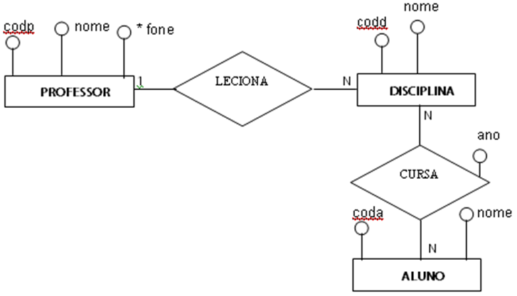
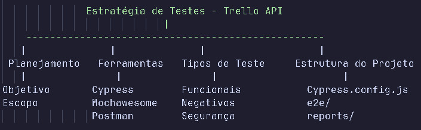

# Prova QA.
## 1)	Quais cenários de teste você especificaria para validar a funcionalidade do aplicativo bancário desenhado abaixo? Liste todas as premissas adotadas.

### Cenários
  #### CT01 - Transferir com um valor maior que o saldo do cliente
    * Não deveria ser possível o cliente transferir um valor maior que o saldo dele.

  #### CT02 - Transferir com um valor menor que o saldo do cliente
    * Cliente deve conseguir transferir um valor menor que o saldo
    * Deverá ser decrementado esse valor ao saldo do cliente. 

  #### CT03 - Transferir com um valor igual ao saldo do cliente
    * Cliente deve conseguir transferir o valor igual ao seu saldo. 
    * Deverá ser decrementado esse valor ao saldo do cliente.
    * Deverá ser somado esse valor ao saldo do destinatário.

  #### CT04 - Transferir com um valor negativo 
    * Não deverá ser possível preencher o campo valor, com um valor negativo. 

  #### CT05 - Transferir com o tipo incorreto de valor. Ex : string
    * Não deverá ser possível preencher o campo valor, com um valor deferente de float, 2 casas decimais após a vírgula. 

  #### CT06 - Transferir sem nehum valor
    * Não devera ser possível submeter a transferencia sem nenhum valor no campo valor. 
    * Campo valor deverá ficar vermelho, ou com algum sinal de obrigatóriedade.

  #### CT07 - Transferir para um data futura para efetivação
    * Deverá ser possível agendar uma transferencia para uma data futura. 
    * Não deverá decrementar do valor do seu saldo. 
    * Quando chegar a data futura, deverá decrementar o valor do saldo do cliente. 

  #### CT08 - Transferir para data atual para efetivação
    * Deverá ser possível fazer uma transferencia para a data atual.
    * O valor deverá ser decrementado do saldo após a transação.

  #### CT09 - Transferir para uma data anterior para efetivação
    * Não deverá ser possível fazer transferencia para uma data anterior a atual.
    * Não poderá ser possível preencher ou deverá ter um aviso para alterar a data inválida.

  #### CT10 - Transferir sem nenhuma data de efetivação
    * Não poderá fazer a transferencia sem preecher o campo data.
    * Deverá ter um aviso que o preenchimento do campo é obrigatório.

  #### CT11 - Transferir para um cliente válido
    * Cliente deverá conseguir fazer a transação para um cliente válido. 

  #### CT12 - Transferir sem nenhum cliente preenchido
    * Não deverá ser possível transferir sem nenhum cliente preenchido.
    * Deverá aparecer alguma mensagem que o campo Cliente destino é obrigatório.

  #### CT13 - Transferir para um cliente inválido
    * Não deverá ser possível fazer uma transferencia para um cliente invalido. 
    * Deverá apresentar uma mensagem de que o cliente não existe. 

  #### CT14 - Cancelar a transferencia
    * Não deverá transferir para o cliente destino quando clicarmos em Cancelar.
    * Deverá retornar para a página/Pop-up anterior. 


## 2)	Considere o esquema Entidade / Relacionamento abaixo:


###	Escreva a consulta SQL para listar o nome de todos os alunos matriculados na   disciplina de Cálculo do professor João.
SELECT a.nome
FROM ALUNO a
JOIN CURSA c ON a.coda = c.coda
JOIN DISCIPLINA d ON c.codd = d.codd
JOIN LECIONA l ON d.codd = l.codd
JOIN PROFESSOR p ON l.codp = p.codp
WHERE d.nome = 'Cálculo' AND p.nome = 'João';

###	Escreva a consulta SQL para exibir a quantidade de alunos por disciplinas.
SELECT d.nome, COUNT(c.codd) AS quantidade_alunos
FROM DISCIPLINA d
LEFT JOIN CURSA c ON d.codd = c.codd
GROUP BY d.nome;

###	Escreva a consulta SQL para listar as disciplinas que todos os professores lecionam.
SELECT d.nome
FROM DISCIPLINA d
WHERE (SELECT COUNT(DISTINCT l.codp) FROM LECIONA l WHERE l.codd = d.codd) = (SELECT COUNT(*) FROM PROFESSOR);

###	Escreva a consulta SQL que exibe o total de professores.
SELECT COUNT(*) AS total_professores
FROM PROFESSOR;

###	Escreva a consulta SQL para listar todos os alunos que cursaram alguma disciplina do ano 2000 até 2020.
SELECT DISTINCT a.nome
FROM ALUNO a
JOIN CURSA c ON a.coda = c.coda
WHERE c.ano BETWEEN 2000 AND 2020;

## 3)	Para validarmos a sua técnica de automação de testes, vamos utilizar uma api de desenvolvimento referente a plataforma Trello.
Caso não conheça o Trello, acessar: www.trello.com
Link da api para desenvolvimento: https://developers.trello.com/docs/api-introduction
Com o end-point acima, crie testes automatizados para as seguintes ações:
*	Cadastrar um board 
*	Cadastrar um card 
*	Excluir um card 
*	Excluir um board 
Obs: Utilizar o Cypress como ferramenta de automação.

Para a automação de testes realizada, ilustre através de um mapa mental, a  sua estratégia de testes para construção do seu projeto.

### Mapa mental



1. Planejamento
   ├─ Objetivo: Validar endpoints do Trello
   └─ Escopo: Board, Card, Exclusões

2. Ferramentas
   ├─ Cypress
   ├─ Mochawesome (relatórios)
   └─ Postman (apoio no entendimento da API)

3. Tipos de Testes
   ├─ Testes Funcionais (CRUD)
   ├─ Testes Negativos (erros esperados)
   ├─ Testes de Segurança (SQL Injection)

4. Estrutura de Projeto

   ├─ e2e/api/apiTrello.js    (Testes)
   ├─ support/api/commands.js (Comandos)
   ├─ Cypress.config.js       (Configuração)
   └─ reports/                (Relatórios)

5. Dados Sensíveis
   └─ .env com API Key e Token


### Plano de teste
  * Objetivo
      * Validar as quatro ações da api rest do Trello. 
        * Cadastrar um board
        * Cadastrar um card
        * Excluir um card
        * Excluir um board

### Escopo

Este plano contempla testes nos seguintes endpoints:

  * Criar um Board (/1/boards/)

  * Criar um Card (/1/cards)

  * Excluir um Card (/1/cards/${cardId})

  * Excluir um Board (/1/boards/${boardId})


### Casos de Teste 
#### ID   - Funcionalidade   Cenário             Resultado Esperado
  * CT01 - Criar Board	    Nome válido	  	    Status 200 + ID do board
  * CT02 - Criar Board	    Nome vazio	  	    Status 400
  * CT03 - Criar Card	      Dados válidos	      Status 200 + ID do card
  * CT04 - Criar Card	      Lista inexistente	  Status 400
  * CT05 - Deletar Card	    ID válido		        Status 200
  * CT06 - Deletar Card	    ID inválido		      Status 400
  * CT07 - Deletar Board	  ID válido		        Status 200
  * CT08 - Deletar Board	  ID inválido		      Status 400


#### Testes de segurança 
##### ID -   Tipo de ataque	 Campo-alvo	   Exemplo	     Resultado Esperado
* CT09 -     SQL Injection	 name / desc	 ' OR 1=1 --	 400 ou tratamento seguro


## Pré-requisitos mínimos de ambiente:

* [Node.js](https://nodejs.org/pt/download) v22.15.19
* [Git](https://git-scm.com/downloads) 2.46.0
* [Cypress](https://docs.cypress.io/app/get-started/install-cypress) 14.3.3

## IDE de desenvolvimento:

* [VSCode](https://code.visualstudio.com/).


## Clone do repositório:

```
git clone https://github.com/leonardotribino/ProvaQA-Cypress.git

```

## Abrir o projeto no VSCode:

* Abra o VSCode >> File >> Open Folder... 
* Navegar até o repositório clonado >> Selecionar a pasta >> Finish.


## Arquivo de configuração:
* Após abrir a pasta do projeto com sucesso no VSCode,
* Agora crie um arquivo ".env" na raiz do projeto com as seguintes variaveis : 
{
    "BASE_URL": "",
    "API_KEY_TRELLO": "", 
    "TOKEN_TRELLO": ""
}

Preencha conforme necessário.

## Execução dos testes:

### Cypress:

* Após abrir a pasta do projeto com sucesso no VSCode, 
* Abra o terminal ctrl+shift+'

### Terminal:

``` 
npx cypress run

```

## Relatório em HTML:
* #### Após a execução dos testes, abra o terminal e digite:

```
npx mochawesome-merge cypress/reports/*.json > cypress/reports/report.json

```

```
npx marge cypress/reports/report.json --reportDir cypress/reports/html

```
* Verifique o resultado dos testes em:
* cypress/reports/html/mochawesome.html


---

<a href="https://www.linkedin.com/in/leonardo-tribino/"></a>

<strong>Leonardo Tribino Siqueira</strong> 🤓 ✌🏻

Senior QA Automation 🔎 🐞